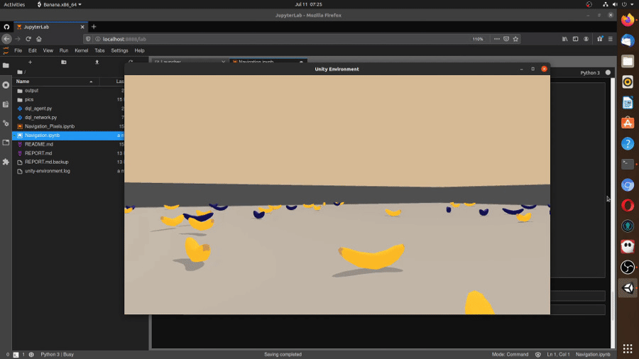

# Project 1: Navigation

### Introduction

For this project, you will train an agent to navigate (and collect bananas!) in a large, square world.  

A reward of +1 is provided for collecting a yellow banana, and a reward of -1 is provided for collecting a blue banana.  Thus, the goal of your agent is to collect as many yellow bananas as possible while avoiding blue bananas.  

The state space has 37 dimensions and contains the agent's velocity, along with ray-based perception of objects around agent's forward direction.  Given this information, the agent has to learn how to best select actions.  Four discrete actions are available, corresponding to:
- **`0`** - move forward.
- **`1`** - move backward.
- **`2`** - turn left.
- **`3`** - turn right.

The task is episodic, and in order to solve the environment, your agent must get an average score of +13 over 100 consecutive episodes.

### Getting Started

1. Download the environment from one of the links below.  You need only select the environment that matches your operating system:
    - Linux: [click here](https://s3-us-west-1.amazonaws.com/udacity-drlnd/P1/Banana/Banana_Linux.zip)
    - Mac OSX: [click here](https://s3-us-west-1.amazonaws.com/udacity-drlnd/P1/Banana/Banana.app.zip)
    - Windows (32-bit): [click here](https://s3-us-west-1.amazonaws.com/udacity-drlnd/P1/Banana/Banana_Windows_x86.zip)
    - Windows (64-bit): [click here](https://s3-us-west-1.amazonaws.com/udacity-drlnd/P1/Banana/Banana_Windows_x86_64.zip)
    
    (_For Windows users_) Check out [this link](https://support.microsoft.com/en-us/help/827218/how-to-determine-whether-a-computer-is-running-a-32-bit-version-or-64) if you need help with determining if your computer is running a 32-bit version or 64-bit version of the Windows operating system.

    (_For AWS_) If you'd like to train the agent on AWS (and have not [enabled a virtual screen](https://github.com/Unity-Technologies/ml-agents/blob/master/docs/Training-on-Amazon-Web-Service.md)), then please use [this link](https://s3-us-west-1.amazonaws.com/udacity-drlnd/P1/Banana/Banana_Linux_NoVis.zip) to obtain the environment.

2. Place the file in the `~/Python/rl/udadrl/data/` folder, and unzip (or decompress) the file **or** feel free to edit the following line in the Notebook directly:
 `env = UnityEnvironment( os.path.join( os.environ['HOME'], 'Python/rl/udadrl/data/Banana_Linux/Banana.x86_64' ) )` 

### Instructions

#### Create an environment
I used mainly standalone machine with Ubuntu Linux 20.04 LTS as an operating system and Anaconda as a development environment.

I strongly suggest you create an environment with **one** of the three files in the root of this repository:

* environment.yml (conda environment file)
* environment_min.yml (minimal conda environment file)
* requirements.txt (classical requirements file)

#### Use the notebook
I refer here to the `Navigation.ipynb` Jupyter Notebook file
##### Training
Reset your kernel first.

If you wish you can adapt the requirement when the environment is considered as solved in section four: `CRIT_SOLVED = 13 #How many Bananas must be collected to succeed?`

Execute the code in sections

* 1. Start the Environment
* 2. Examine the State and Action Spaces
* 4. It's My Turn! - Train the agent!

The output file will be generated in the `./output` directory with a current time stamp as prefix of the `_qnetwork_local_statedict.pth` output file name.

##### Testing
Reset your kernel first.

Enter the filename in section five by adapting the code line `FILENAME = '20200707113405_qnetwork_local_statedict_slvd_15.pth'`, assigning the proper filename to the variable `FILENAME`.

If you want to test a trained agent fast and are just interested in the statistics over many testing runs you should set the train mode to `True` in section five:

`env_info = env.reset(train_mode=False)[brain_name] # Reset & train_mode => False -> fast & True -> slow`

and adapt the number of epochs accordingly in section five too:

`for epc in range(3):`

Execute the code in sections

* 1. Start the Environment
* 2. Examine the State and Action Spaces
* 5. Watch the trained agent in action!

