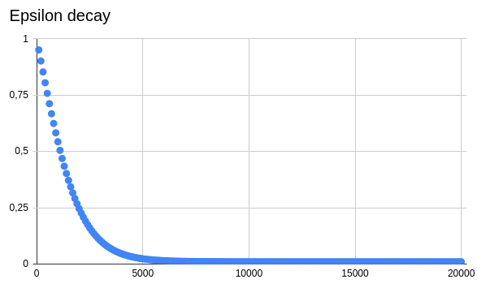
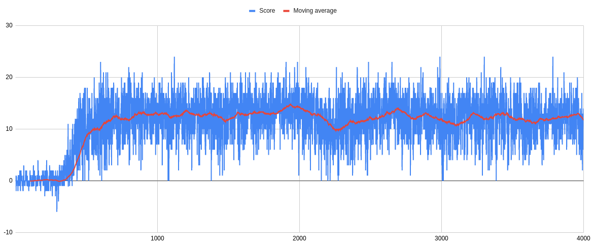
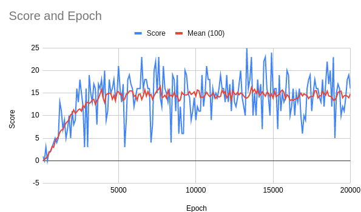
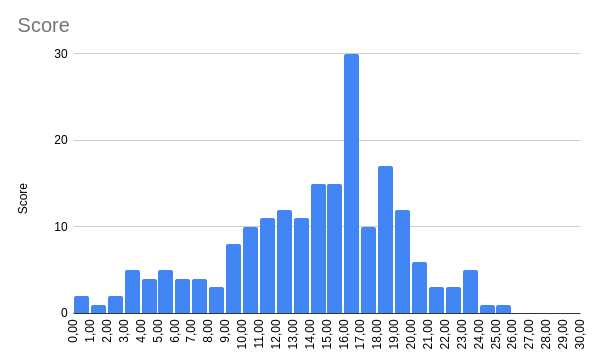
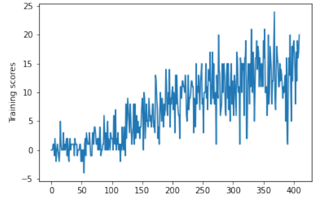

# Report for Project One: Navigation for the Udacity Deep Reinforcement Learning Nanodegree.

By:			Dr. Ferenc Acs from Filderstadt in Germany

Date:		12th of July 2020

Version: 	1.0

## Problem description
The goal of this project was to create a self learning agent that can collect yellow bananas in a 3D environment while avoiding blue bananas. This 3D environment was provided by [Udacity](https://www.udacity.com/) and is based on the [Machine learning framework](https://unity3d.com/machine-learning) provided by [Unity](https://unity.com/).

This project should be implemented by using [Deep Q learning](https://en.wikipedia.org/wiki/Q-learning#Deep_Q-learning) for training an virtual agent in this environment that would lead to a well performing model of this agent.

## Deep Q-learning
[Deep Q learning](https://en.wikipedia.org/wiki/Q-learning#Deep_Q-learning) is an extension of the classical [Q learning](https://en.wikipedia.org/wiki/Q-learning) algorithm used in [reinforcement learning](https://en.wikipedia.org/wiki/Reinforcement_learning). The main advantage over classical Q learning is that the state space does not need to be represented in discrete states any more. More realistically the state space can be represented now by continuous values describing it. This raised a mathematical problem, for long years it was impossible to use [function approximation](https://en.wikipedia.org/wiki/Function_approximation) to get a function that would approximate the ideal behavior of an agent to catch a lot of yellow bananas while avoiding the blue ones. The problem is that one would need a function that takes the description of the current state, also called the state values, as an input and delivers the best action to take in this situation, aka predicted state values, as an output of these state action pairs.

### The problem with Q-learning
A solution to this approximation problem came along with [artificial neural networks](https://en.wikipedia.org/wiki/Artificial_neural_network) and the [backpropagation algorithm](https://en.wikipedia.org/wiki/Backpropagation). Before it was necessary to describe the states in discrete numerical values, which is quite challenging when you have an agent foraging along a large playing field for yellow bananas while avoiding the blue ones of course. You would have to seperate the playing field in a chessboard like structure, resulting in a table called the [Q-Table](https://en.wikipedia.org/wiki/Q-learning#Algorithm) and determine for every field of this table the optimal course of action when your agent performs its mad rush. Did I mention that  more yellow bananas randomly fall on the playing field when your agent collects the old ones? Well, yes. Soon you would discover that the partitioning of the chessboard is not right, for example when you have one yellow and one blue banana in the same square the decision what to do is not easy. It is possible to construct quite sophisticated mathematical workarounds to minimize this problem, but you never will get rid of it completely.

### How Q-learning became deep
It would all be easier if we just can provide the *coordinates* of the agent and the speed and direction where it is moving to, all in floating point values. Wouldn't it? Well yes but then you would have lost the checkerboard partitioning of the playing field and deal with a potentially infinite checkerboard, which would make the problem not solvable, for even the biggest existing computers. Fortunately [artificial neural networks](https://en.wikipedia.org/wiki/Artificial_neural_network) came to the rescue! 

It turns out that you can do exactly that with artificial neural networks. You describe the the situation, the state, utilizing floating point numbers and get the recommended action back. If the action was not the right one, e.g. when catching a blue banana, you give this error as a feedback to the neural network and voilá you have [Deep Q learning](https://en.wikipedia.org/wiki/Q-learning#Deep_Q-learning)!!

Of course it is **not that simple** but the purpose of this report is just to give you a broad picture of this project.

### The algorithm
Deep Q-Learning is based on Q learning ([source](https://en.wikipedia.org/wiki/Q-learning#Algorithm)):

In essence we want to know the *temporal difference* between two states which are discrete in time. Furthermore we assume that the actions of our agent influence the states. Based on the action taken in the past (*old value*) and the action taken now (*new value - temporal differnce target*) we get the estimate of the resulting *temporal difference*, which also can be seen as the consequence (*reward*) of the chosen action (*estimate of optimal future value*). Thus we utilize the *temporal difference* to update the Q-Table in small steps (*learning rate*) towards a more optimal Q-Table. The *discount factor* should stay equal to or below one. If it stays below one it prioritizes recent outcomes over ones more in the past. 

In essence the idea behind making Q-learning deep is to replace the Q-Table with an artificial neural network, thus providing a much more fine grained function approximator. This seemingly simple idea comes with a lot of caveats which basically result in unstable solutions. This is because simply adapting and applying the Q-learning algorithm for the use with artificial neural networks leads to wild fluctuations in the weight updates which essentially result in a unusable approach.

Two techniques are used to get this under control.

**Experience replay** provides a pool of past outcomes of actions taken in certain states. This 'memory' serves the purpose of averaging out the fluctuations by making the weight updates based on a random chosen entry of this pool of past outcomes instead of the just most recently taken action and its immediate outcome. 

**Fixed Q-Targets** The basic idea behind this is not to update the artificial neural network every time after some action was taken and the outcome was observed. Instead make a copy of the network and 'freeze' it in time. The updates are then performed on the copy instead. After a specified amount of time steps the copy is made the actual network and the process repeats. This fixes the targets over the specified amount of time steps, thus stabilizing the learning process. Otherwise we will risk wild fluctuations again.

An in deep discussion of these approaches can be found in two research papers that were recommended during the course:

* Riedmiller, M. (2005, October). [Neural fitted Q iteration–first experiences with a data efficient neural reinforcement learning method.](http://ml.informatik.uni-freiburg.de/former/_media/publications/rieecml05.pdf) In European Conference on Machine Learning (pp. 317-328). Springer, Berlin, Heidelberg.

* Mnih, V., Kavukcuoglu, K., Silver, D., Rusu, A. A., Veness, J., Bellemare, M. G., ... & Petersen, S. (2015). [Human-level control through deep reinforcement learning.](http://files.davidqiu.com//research/nature14236.pdf) nature, 518(7540), 529-533.

## The banana environment
The banana environment is a simulation of a 3D playing field with a lot of yellow and blue bananas. It is a simplification of the [Food Collector environemnt](https://github.com/Unity-Technologies/ml-agents/blob/master/docs/Learning-Environment-Examples.md#food-collector).

	Number of actions: 4
	States look like: [1.         0.         0.         0.         0.84408134 0.
	 0.         1.         0.         0.0748472  0.         1.
	 0.         0.         0.25755    1.         0.         0.
	 0.         0.74177343 0.         1.         0.         0.
	 0.25854847 0.         0.         1.         0.         0.09355672
	 0.         1.         0.         0.         0.31969345 0.
	 0.        ]
	States have length: 37

Our agent can perform four actions, it can move forward, move backward, turn left and finally turn right. The state vector is a 37 dimensional representation of the environment the agent is currently in. 

For a detailed description of the banana environment see the excellent report of [Wilbert Pumacay](https://twitter.com/WilbertPumacay): [Using DQN to solve the Banana environment from ML-Agents](https://wpumacay.github.io/research_blog/posts/deeprlnd-project1-navigation/)

## The deep-Q network
Well, actually my network is not *that* deep that it would deserve the title of a deep neural network, but I guess I have to go along with the *zeitgeist* and can not simply call it an artificial neural network architecture used as a function approximator for Q-learning.

        Layer	1 		fc1 = nn.Linear(37, 128)
        Dropout	1		dr1 = nn.Dropout(p=0.3)
        Layer 	2		fc2 = nn.Linear(128, 64)
        Dropout	2 		dr2 = nn.Dropout(p=0.1)
        Layer	3		fc3 = nn.Linear(64, 32)
        Layer	4		fc4 = nn.Linear(32, 4)
   
I have constructed here a simple network with a just four layers, the activation for all neurons in the network was calculated by a simple [ReLU activation function](https://pytorch.org/docs/stable/nn.html#torch.nn.ReLU). One *input layer* with 37 inputs, representing the state of the environment. Two *hidden layers* with a 30% probability of dropout for the first and a 10% probability of dropout for the second. Finally one *output layer* with the four possible actions as output. The terminology follows the convention of [how to construct a neural network with Pytorch](https://pytorch.org/tutorials/beginner/blitz/neural_networks_tutorial.html). Don't worry about the dropout layers, they are not really layers, they just block the signal propagation for certain neurons. This is a technique called [Dilution or Dropout](https://en.wikipedia.org/wiki/Dilution_(neural_networks)) and should prevent a phenomenon called overfitting. In our banana environment you could imagine this as preventing the agent developing certain *stubborn* behavior, for example *only turning right* while moving forward or standing still. Possible but uneconomical. To my surprise I later learned that dropout techniques are not used in deep reinforcement learning. Well, they worked well enough for this environment.

## Epsilon policy
I constructed a modified Epsilon policy using the [tanh](https://en.wikipedia.org/wiki/Hyperbolic_functions) function from the [math package](https://docs.python.org/3/library/math.html#hyperbolic-functions) in python:

	epsilon = [epsilon_min+(1.0-epsilon_min)*(1-tanh(10*(i/num_episodes))) for i in range(num_episodes+10)]

Which leads to a nice drop over all training episodes  `num_episodes` with a minimal value of `epsilon_min`:

## Results
The framework of this network was taken from the [Lunar Lander Mini Project](https://github.com/ferenc-acs/udacity-deep-reinforcement-learning/tree/master/dqn) on the [Udacity GitHub Repo](https://github.com/udacity/deep-reinforcement-learning). During the course I created the network you see above for the Lunar Lander environment, so the hyperparameters and the network architecture were transferred. The configuration worked surprisingly well from the beginning:

So I kept the network architecture and the following hyperparameters:

	BUFFER_SIZE = int(1e5)  # replay buffer size
	BATCH_SIZE = 64         # minibatch size
	GAMMA = 0.99            # discount factor
	TAU = 1e-3              # for soft update of target parameters
	LR = 5e-4               # learning rate 
	UPDATE_EVERY = 4        # how often to update the network

To determine what maximum score can be achieved by this model I started a very extensive training run over 20000 episodes.

The maximum score achived was 25 with a maximum rolling 100 mean of 16,5. A rolling 100 mean of above 16 was achieved 4 times and a rolling 100 mean above 15 was achieved 46 times.

To my surprise it turned out that the model `20200707113405_qnetwork_local_statedict_slvd_15.pth` was the best performing, hence it only had a threshold of 15 to abort training.

It took 410 episodes for this model to solve the environment by reaching the criterion set by Udacity of a rolling mean of at least 13 over the last 100 episodes:

## Conclusions
It was kind of surprising that the lunar lander architecture worked so well. I was also surprised by the fact that simple Deep Q-Learning along with a very minimalistic neural network architecture were sufficient to solve this environment.

## Outlook
I would like to solve the pixel based navigation environment. Unfortunately I did not have time to do this in the course due to two main delays. First I had to order an SSD for my home computer to be able to install a dual boot Windows 10 and Ubuntu Linux 20.04 LTS system. Second I had to learn the proper use of Git and GitHub to document the project progress properly, as a mentor advised me.

I expect that a simple Deep Q-Learning algorithm will not be enough any more to solve pixel based navigation.

## Appendix
### Test results with epsilon = 0.01
#### Results of model `20200707175101_qnetwork_local_statedict_slvd_15-65.pth`:
	Epoch:  100; Score:  17.0; Execution time: 0.5268 ; 12.94 (mea); 4.52 (std)
	Epoch:  200; Score:   9.0; Execution time: 0.4870 ; 12.79 (mea); 5.17 (std)
	Epoch:  300; Score:   9.0; Execution time: 0.4850 ; 13.78 (mea); 3.92 (std)
	Epoch:  400; Score:  16.0; Execution time: 0.5349 ; 12.99 (mea); 4.21 (std)
	Epoch:  500; Score:  14.0; Execution time: 0.5287 ; 13.41 (mea); 4.84 (std)
	Epoch:  600; Score:  15.0; Execution time: 0.5054 ; 13.38 (mea); 4.61 (std)
	Epoch:  700; Score:  18.0; Execution time: 0.4341 ; 12.27 (mea); 4.55 (std)
	Epoch:  800; Score:  14.0; Execution time: 0.5291 ; 12.71 (mea); 5.04 (std)
	Epoch:  900; Score:   8.0; Execution time: 0.4939 ; 12.99 (mea); 4.38 (std)
	Epoch: 1000; Score:  12.0; Execution time: 0.4374 ; 13.15 (mea); 4.11 (std)
	Achieved mean and standard deviation over 1000 test runs: 13.04 (mea) 4.57 (std)

#### Results of model `20200707121910_qnetwork_local_statedict_slvd_15-60.pth`:
	Epoch:  100; Score:   6.0; Execution time: 0.5083 ; 13.92 (mea); 6.02 (std)
	Epoch:  200; Score:  14.0; Execution time: 0.5059 ; 14.21 (mea); 5.48 (std)
	Epoch:  300; Score:  15.0; Execution time: 0.4926 ; 13.48 (mea); 5.41 (std)
	Epoch:  400; Score:   0.0; Execution time: 0.5430 ; 13.93 (mea); 5.40 (std)
	Epoch:  500; Score:   5.0; Execution time: 0.4472 ; 13.90 (mea); 5.74 (std)
	Epoch:  600; Score:  12.0; Execution time: 0.4806 ; 13.13 (mea); 5.73 (std)
	Epoch:  700; Score:  14.0; Execution time: 0.5353 ; 14.38 (mea); 5.04 (std)
	Epoch:  800; Score:  18.0; Execution time: 0.5122 ; 14.20 (mea); 5.37 (std)
	Epoch:  900; Score:  19.0; Execution time: 0.5144 ; 13.64 (mea); 5.91 (std)
	Epoch: 1000; Score:  17.0; Execution time: 0.5158 ; 14.36 (mea); 5.12 (std)
	Achieved mean and standard deviation over 1000 test runs: 13.91 (mea) 5.55 (std) 

#### Results of model `20200707113405_qnetwork_local_statedict_slvd_15.pth`:
	Epoch:  100; Score:  13.0; Execution time: 0.5637 ; 17.38 (mea); 3.19 (std)
	Epoc	h:  200; Score:  19.0; Execution time: 0.5059 ; 16.74 (mea); 3.39 (std)
	Epoch:  300; Score:  20.0; Execution time: 0.4793 ; 16.58 (mea); 3.96 (std)
	Epoch:  400; Score:  18.0; Execution time: 0.4829 ; 16.97 (mea); 3.66 (std)
	Epoch:  500; Score:  17.0; Execution time: 0.4937 ; 16.38 (mea); 3.60 (std)
	Epoch:  600; Score:  16.0; Execution time: 0.5240 ; 16.80 (mea); 3.99 (std)
	Epoch:  700; Score:  18.0; Execution time: 0.5202 ; 16.52 (mea); 3.65 (std)
	Epoch:  800; Score:  18.0; Execution time: 0.5129 ; 16.52 (mea); 3.16 (std)
	Epoch:  900; Score:  16.0; Execution time: 0.4971 ; 16.83 (mea); 3.84 (std)
	Epoch: 1000; Score:   8.0; Execution time: 0.4434 ; 17.03 (mea); 3.54 (std)
	Achieved mean and standard deviation over 1000 test runs: 16.77 (mea) 3.62 (std) 

#### Results of model `20200707090905_qnetwork_local_statedict_tst_20000.pth`:
	Epoch:  100; Score:  17.0; Execution time: 0.5030 ; 16.06 (mea); 4.09 (std)
	Epoch:  200; Score:  17.0; Execution time: 0.4851 ; 16.18 (mea); 3.58 (std)
	Epoch:  300; Score:  21.0; Execution time: 0.5040 ; 15.15 (mea); 4.88 (std)
	Epoch:  400; Score:  20.0; Execution time: 0.4864 ; 16.12 (mea); 4.25 (std)
	Epoch:  500; Score:  13.0; Execution time: 0.4885 ; 16.49 (mea); 4.41 (std)
	Epoch:  600; Score:  14.0; Execution time: 0.4979 ; 15.36 (mea); 4.19 (std)
	Epoch:  700; Score:  15.0; Execution time: 0.5158 ; 16.55 (mea); 3.48 (std)
	Epoch:  800; Score:  14.0; Execution time: 0.5110 ; 14.85 (mea); 5.12 (std)
	Epoch:  900; Score:  13.0; Execution time: 0.4769 ; 15.95 (mea); 4.64 (std)
	Epoch: 1000; Score:  14.0; Execution time: 0.5042 ; 15.97 (mea); 4.20 (std)
	Achieved mean and standard deviation over 1000 test runs: 15.87 (mea) 4.34 (std)
	
#### Results of model `20200709154642_qnetwork_local_statedict_slvd_13.pth`:
	Epoch:  100; Score:  19.0; Execution time: 0.5170 ; 16.34 (mea); 3.79 (std)
	Epoch:  200; Score:  15.0; Execution time: 0.4680 ; 15.48 (mea); 4.62 (std)
	Epoch:  300; Score:  14.0; Execution time: 0.5006 ; 15.94 (mea); 3.83 (std)
	Epoch:  400; Score:  16.0; Execution time: 0.4804 ; 15.65 (mea); 4.20 (std)
	Epoch:  500; Score:  16.0; Execution time: 0.5349 ; 16.09 (mea); 4.04 (std)
	Epoch:  600; Score:  18.0; Execution time: 0.5332 ; 15.93 (mea); 4.26 (std)
	Epoch:  700; Score:  11.0; Execution time: 0.4775 ; 16.07 (mea); 3.51 (std)
	Epoch:  800; Score:  17.0; Execution time: 0.5320 ; 15.96 (mea); 3.24 (std)
	Epoch:  900; Score:  19.0; Execution time: 0.5421 ; 15.76 (mea); 3.39 (std)
	Epoch: 1000; Score:  17.0; Execution time: 0.4930 ; 16.24 (mea); 3.62 (std)
	Achieved mean and standard deviation over 1000 test runs: 15.95 (mea) 3.88 (std) 

### Test results with epsilon = 0.0
#### Results of model `20200707175101_qnetwork_local_statedict_slvd_15-65.pth`:
	Epoch:  100; Score:  15.0; Execution time: 0.6037 ; 12.56 (mea); 5.17 (std)
	Epoch:  200; Score:   9.0; Execution time: 0.5122 ; 12.52 (mea); 5.57 (std)
	Epoch:  300; Score:  20.0; Execution time: 0.8065 ; 13.53 (mea); 4.78 (std)
	Epoch:  400; Score:  15.0; Execution time: 0.4709 ; 12.74 (mea); 5.13 (std)
	Epoch:  500; Score:  12.0; Execution time: 0.4838 ; 12.51 (mea); 4.46 (std)
	Epoch:  600; Score:  21.0; Execution time: 0.5099 ; 13.04 (mea); 4.97 (std)
	Epoch:  700; Score:  14.0; Execution time: 0.4976 ; 12.84 (mea); 5.28 (std)
	Epoch:  800; Score:  12.0; Execution time: 0.5313 ; 13.50 (mea); 4.07 (std)
	Epoch:  900; Score:   2.0; Execution time: 0.5005 ; 13.47 (mea); 5.16 (std)
	Epoch: 1000; Score:  16.0; Execution time: 0.5151 ; 12.65 (mea); 5.02 (std)
	Achieved mean and standard deviation over 1000 test runs: 12.94 (mea) 4.99 (std) 

#### Results of model `20200707121910_qnetwork_local_statedict_slvd_15-60.pth`:
	Epoch:  100; Score:   2.0; Execution time: 0.5128 ; 12.89 (mea); 5.83 (std)
	Epoch:  200; Score:  20.0; Execution time: 0.5231 ; 13.70 (mea); 6.21 (std)
	Epoch:  300; Score:  11.0; Execution time: 0.5483 ; 13.25 (mea); 6.13 (std)
	Epoch:  400; Score:   9.0; Execution time: 0.6469 ; 12.85 (mea); 6.19 (std)
	Epoch:  500; Score:   0.0; Execution time: 0.5595 ; 13.51 (mea); 5.64 (std)
	Epoch:  600; Score:  15.0; Execution time: 0.4984 ; 13.74 (mea); 5.96 (std)
	Epoch:  700; Score:   8.0; Execution time: 0.5266 ; 13.05 (mea); 5.97 (std)
	Epoch:  800; Score:   7.0; Execution time: 0.4909 ; 13.39 (mea); 6.57 (std)
	Epoch:  900; Score:  11.0; Execution time: 0.4319 ; 13.35 (mea); 5.81 (std)
	Epoch: 1000; Score:   7.0; Execution time: 0.5190 ; 14.15 (mea); 6.02 (std)
	Achieved mean and standard deviation over 1000 test runs: 13.39 (mea) 6.05 (std) 

#### Results of model `20200707113405_qnetwork_local_statedict_slvd_15.pth`:
	Epoch:  100; Score:  20.0; Execution time: 0.5020 ; 16.32 (mea); 4.88 (std)
	Epoch:  200; Score:  16.0; Execution time: 0.5210 ; 16.03 (mea); 3.91 (std)
	Epoch:  300; Score:  16.0; Execution time: 0.4931 ; 16.63 (mea); 3.55 (std)
	Epoch:  400; Score:  16.0; Execution time: 0.5358 ; 16.68 (mea); 4.27 (std)
	Epoch:  500; Score:  19.0; Execution time: 0.5252 ; 17.12 (mea); 3.88 (std)
	Epoch:  600; Score:   8.0; Execution time: 0.4970 ; 16.18 (mea); 3.76 (std)
	Epoch:  700; Score:  17.0; Execution time: 0.5191 ; 16.22 (mea); 4.41 (std)
	Epoch:  800; Score:  18.0; Execution time: 0.5261 ; 16.03 (mea); 4.36 (std)
	Epoch:  900; Score:  11.0; Execution time: 0.5092 ; 16.62 (mea); 4.20 (std)
	Epoch: 1000; Score:  12.0; Execution time: 0.5190 ; 16.63 (mea); 4.42 (std)
	Achieved mean and standard deviation over 1000 test runs: 16.45 (mea) 4.19 (std) 

#### Results of model `20200707090905_qnetwork_local_statedict_tst_20000.pth`:
	Epoch:  100; Score:  15.0; Execution time: 0.5072 ; 15.67 (mea); 4.68 (std)
	Epoch:  200; Score:  19.0; Execution time: 0.5109 ; 15.80 (mea); 4.82 (std)
	Epoch:  300; Score:  15.0; Execution time: 0.5103 ; 15.73 (mea); 5.02 (std)
	Epoch:  400; Score:  14.0; Execution time: 0.4631 ; 15.78 (mea); 5.22 (std)
	Epoch:  500; Score:  19.0; Execution time: 0.5234 ; 16.01 (mea); 4.75 (std)
	Epoch:  600; Score:  19.0; Execution time: 0.4905 ; 16.16 (mea); 3.99 (std)
	Epoch:  700; Score:  11.0; Execution time: 0.4618 ; 15.75 (mea); 4.92 (std)
	Epoch:  800; Score:  15.0; Execution time: 0.4888 ; 15.72 (mea); 4.99 (std)
	Epoch:  900; Score:  23.0; Execution time: 0.5230 ; 14.90 (mea); 5.12 (std)
	Epoch: 1000; Score:  16.0; Execution time: 0.5130 ; 15.64 (mea); 4.96 (std)
	Achieved mean and standard deviation over 1000 test runs: 15.72 (mea) 4.87 (std) 

#### Results of model `20200709154642_qnetwork_local_statedict_slvd_13.pth`: 
	Epoch:  100; Score:  20.0; Execution time: 0.5305 ; 14.89 (mea); 4.91 (std)
	Epoch:  200; Score:  14.0; Execution time: 0.5019 ; 15.63 (mea); 4.56 (std)
	Epoch:  300; Score:  19.0; Execution time: 0.5201 ; 16.01 (mea); 4.28 (std)
	Epoch:  400; Score:   6.0; Execution time: 0.5069 ; 15.78 (mea); 3.82 (std)
	Epoch:  500; Score:  18.0; Execution time: 0.5139 ; 15.64 (mea); 4.01 (std)
	Epoch:  600; Score:  10.0; Execution time: 0.4648 ; 16.45 (mea); 4.11 (std)
	Epoch:  700; Score:  16.0; Execution time: 0.4758 ; 16.07 (mea); 3.76 (std)
	Epoch:  800; Score:  20.0; Execution time: 0.4841 ; 15.66 (mea); 4.44 (std)
	Epoch:  900; Score:  18.0; Execution time: 0.4905 ; 15.54 (mea); 5.53 (std)
	Epoch: 1000; Score:  22.0; Execution time: 0.5002 ; 15.93 (mea); 4.70 (std)
	Achieved mean and standard deviation over 1000 test runs: 15.76 (mea) 4.46 (std) 

